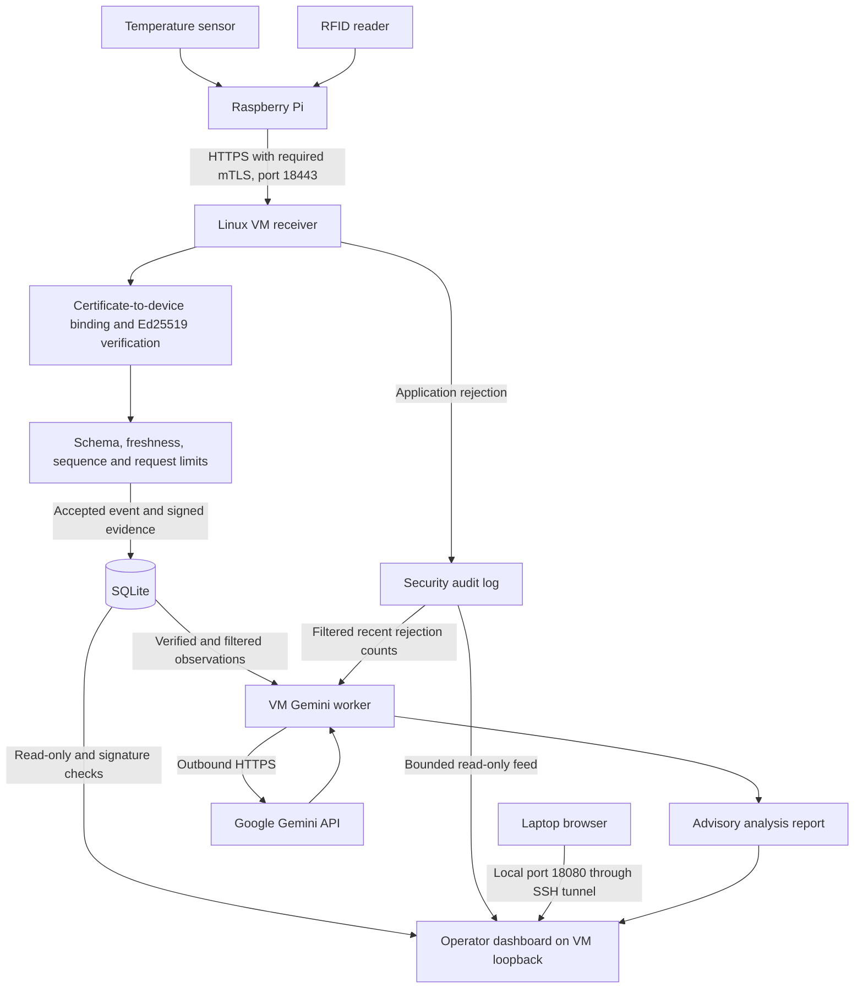

# Complete v8 release

Start with [START_HERE.md](START_HERE.md) for this consolidated ZIP. It includes Gemini and the latest server-authorized RFID/LCD/LED update (green BCM22, red BCM23). Earlier scope and evidence notes below describe the project's progression; the LED update is now included, but physical operation must be verified on deployment. No physical door lock is implemented.

# RackGuard

## Verified telemetry and security visibility for data-centre racks

**Track 3: Security & Resilience — final locked hackathon scope**

> We do not only monitor the rack. We verify whether its monitoring data can be trusted.

RackGuard is a Raspberry Pi and Linux VM prototype for monitoring temperature and RFID activity around a data-centre rack or restricted server room. It authenticates the connection, verifies signed messages, rejects stale or replayed submissions, retains verifiable event evidence, and presents readings and security alerts to an authenticated operator. Gemini provides advisory explanations of filtered observations.

This README describes the locked presentation scope: the Ed25519/mTLS ingestion application, v7 operator dashboard and Gemini add-on. It is not a claim of production certification or protection against every attack.

## 1. Problem and purpose

A monitoring system can receive misleading readings, repeated messages or unauthorized submissions. A dashboard alone cannot establish whether its data should be accepted.

RackGuard addresses four questions:

1. Is this connection from an enrolled device?
2. Was this message changed, delayed or replayed?
3. Do stored telemetry fields still match their signed evidence?
4. Can an operator see and understand rejected requests?

The demonstration is **accepted telemetry → modified-message rejection → visible alert → continued legitimate monitoring**.

## 2. Locked scope and current evidence

### Implemented and supported by reported results

- Pi-to-VM telemetry has returned successful HTTP 201 responses.
- Mutual TLS and Ed25519 are implemented in the secure ingestion application.
- The 35-test ingestion/dashboard/security suite passed on the VM.
- The authenticated dashboard has displayed live readings and rejection history.
- The Gemini worker successfully generated and saved a report on the VM.
- Certificate provisioning includes finite validity periods.

### Must be confirmed during the final rehearsal

- A physical temperature reading reaches the dashboard with the correct simulation flag.
- A real RFID card scan reaches the dashboard; reader detection alone is insufficient evidence.
- The running system rejects the demonstration's modified message and shows the corresponding alert.
- Valid sensor traffic continues afterward.
- The AI Analyzer displays the saved Gemini report and its generation time.
- Deployed certificate expiry dates are captured from the actual certificate files.

Earlier evidence includes simulated telemetry. Present simulated and physical demonstrations accurately. Test-suite success does not substitute for a successful live demonstration.

### Outside the locked scope

- Computer vision, facial recognition or identifying a human versus a robot.
- A honeypot.
- Automatic certificate renewal or a full revocation service.
- Automatic crash recovery, durable offline telemetry buffering or guaranteed delivery.
- Physical door locking, buzzer/PIR/LCD actions unless separately implemented and demonstrated.
- AI-controlled authorization, device blocking or security-policy changes.
- Production availability, full VM-compromise resistance or comprehensive penetration testing.

Do not add these features before completing evidence and rehearsal.

## 3. Architecture and trust boundaries



The diagram groups controls for readability; it is not the precise order of every code branch.

### Device ingestion

- Pi address used in the team environment: `10.40.40.20`.
- VM address: `172.16.40.10`.
- Telemetry endpoint: `https://172.16.40.10:18443/events`.
- The receiver requires a client certificate. It binds the enrolled certificate fingerprint to the claimed device identity.
- The Pi verifies the server certificate. Do not disable TLS verification.
- The configured firewall rule restricts ingestion to the team's Pi address; an IP allowlist complements cryptographic authentication.

### Operator access

- Dashboard runs separately on VM `127.0.0.1:18080`.
- Laptop browser reaches it through an authenticated, encrypted SSH tunnel.
- Dashboard login uses a separate operator password, stored as a hash.
- Browser access does not use the Pi's private key or weaken ingestion mTLS.
- Do not open VM port 18080 to the LAN or bind the dashboard to `0.0.0.0`.
- The browser's local HTTP address is deliberate: the laptop-to-VM connection is protected by SSH. Public hosting would require a separate production design.

## 4. Security controls and their limits

### Mutual TLS and device identity

Both endpoints authenticate certificates. Application-level fingerprint binding prevents another CA-issued certificate from automatically impersonating the enrolled Pi.

This identifies an enrolled credential, not the physical integrity of the device. A stolen private key or compromised Pi remains a risk.

### Ed25519 message signatures

The Pi signs event bytes. The receiver verifies the signature before accepting the event. Modifying the message after signing causes rejection.

A valid signature establishes message origin/integrity under the key assumptions. It does not prove that a sensor measurement is physically accurate.

### Freshness and replay protection

- The receiver checks timestamps against a 60-second tolerance.
- Persistent sequence state rejects reused or lower sequence numbers.
- State is designed to survive process restarts and is covered by automated tests.
- Keep Pi and VM clocks synchronized. Different display time zones are acceptable.

Freshness does not detect a compromised sensor signing newly fabricated readings. Repeated temperature values alone do not prove replay. Do not reset counters or disable freshness to hide a failing test.

### Limited device capability

- Telemetry submission uses POST `/events`.
- This endpoint does not provide a database-read capability.
- Example configuration limits payloads to 8 KiB.
- Example rate configuration is a token bucket replenishing at 36 requests/minute with a burst capacity of 8; it is not a strict fixed-minute counter.
- The authenticated operator dashboard is a separate read-only interface.

These controls reduce misuse; they are not a complete denial-of-service defence.

### RFID pseudonymization and access outcomes

RFID UIDs are transformed locally into keyed HMAC tokens. The Ed25519 signature protects the telemetry message; RFID HMAC has a separate pseudonymization role.

HMAC tokens do not prevent physical card cloning or prove the identity of the card holder. An accepted RFID event can still contain `access_granted: false`: accepting telemetry and granting access are different decisions. A displayed access decision does not prove a physical lock moved.

### Database evidence

Accepted events retain signed raw bytes and a signature. The verifier checks supported stored telemetry fields against that evidence. The dashboard withholds rows that fail its verification.

- Current database: SQLite, not MySQL.
- Dashboard verification is limited to its latest selected window, up to 200 rows.
- Legacy rows without proof are classified separately.
- Server metadata such as receipt time and access outcome is not covered by the Pi signature.
- Signed rows alone do not prove database completeness or prevent deletion, rollback, or full server compromise.

### Certificate expiry

Provisioning code creates a CA valid for 30 days and leaf certificates valid for 7 days. Actual deployed dates must be checked from the certificates.

Expiry is part of TLS certificate validation on new handshakes, not an automatic disconnect timer for every already-established session. The existing 35-test suite does not explicitly demonstrate expired-certificate rejection.

Renewing the Pi certificate changes its fingerprint, so enrollment must also be updated. Do not shorten live certificate lifetimes for a demo. A future expiry test should use isolated temporary certificates.

## 5. Dashboard and alerts

The five dashboard tabs are Live Overview, Network Health, Analytics, Security Alerts and AI Analyzer.

- Live charts use verified database events.
- Simulation indicators reflect event flags.
- Fresh/stale/unavailable states help distinguish old readings from live telemetry.
- Connection/polling metrics describe dashboard requests; they are not overall infrastructure uptime or sensor-link latency.
- Background and chart assets are local.

The Security Alerts panel reads the existing receiver rejection log. It shows reasons such as invalid signatures, replay, identity mismatch, timestamp failures and rate limits.

- Polls approximately every three seconds.
- Reads a bounded tail of at most 256 KiB and returns up to 100 supported recent records.
- Recent high-priority records raise a banner, once per browser page session.
- Dismissing the banner does not delete server evidence.
- Rejections may result from attacks, configuration errors or intentional tests.
- TLS handshake failures happen before Flask and are outside this application alert feed.
- Source IP/device attribution is not invented when absent from the audit record.
- Database integrity observations are displayed separately.

Audit logs are server-generated, not Pi-signed. Missing logs do not prove there were no attacks.

## 6. Gemini advisory analysis

The VM worker uses Google's Gemini API. It sends reduced observations: temperatures, relative reading ages, simulation flags, RFID access outcomes and recent rejection counts. It excludes raw RFID identifiers, card tokens, device identifiers, certificates and private keys.

Gemini explains observations, possible causes, suggested checks and limitations. It cannot execute actions, unlock doors, grant access or modify validation rules.

- API key is stored only in VM `.env`.
- A one-shot run generates a saved report.
- Optional watch mode waits 60 seconds between completed runs and uses API quota.
- The dashboard reads the report approximately every 15 seconds; its refresh button does not trigger a paid API call.
- On failure, the previous report is retained and becomes stale after five minutes. Missing reports remain unavailable.
- Do not invent a safe temperature threshold; an installation-specific range requires validation.

Gemini is a usability feature, not the root of trust. Server checks and telemetry continue independently of the API.

## 7. Team responsibilities

- **Network/VM lead:** connectivity, firewall scope, server access, certificate deployment checks, dashboard tunnel, demonstration coordination and evidence submission.
- **Computer science lead:** receiver/sender integration, signatures, persistence, API rules, tests and bug fixes.
- **AI lead:** Gemini configuration, filtered report input, useful explanations, failure handling and AI presentation.
- **Mechatronics lead:** sensor wiring, physical RFID/temperature validation, hardware adapter and honest simulation labels.

Members can support each other, but keep one owner per live process/configuration change during rehearsal.

## 8. Files and configuration

The v7 package contains the ingestion application, provisioning utilities, dashboard, tests and deployment guides. The Gemini add-on supplies `gemini_worker.py`, `setup_gemini.py`, `test_gemini.py` and `GEMINI_SETUP.md`; copy these into the installed v7 folder.

Key files:

- `sender.py`, `hardware.py`: Pi telemetry and hardware integration.
- `receiver.py`, `security.py`, `transport.py`: ingestion and cryptographic checks.
- `counter.py`: persistent sequence management.
- `verify_database.py`: stored telemetry evidence verification.
- `dashboard.py`, `alerts.py`, `templates/`, `static/`: operator interface.
- `demo_alert.py`: one modified-message demonstration.
- `gemini_worker.py`, `setup_gemini.py`: Gemini add-on.
- `config.pi.example.json`, `config.vm.example.json`: configuration templates.

Compatibility names such as `coldguard-pi-01` and `~/.local/state/coldguard` remain intentionally unchanged to preserve enrollment and state. They do not mean the final story is still a refrigerator.

Private runtime configuration:

- Pi/receiver configuration: `config.json` in each installed application directory.
- Dashboard/Gemini settings: `.env` in the v7 directory.
- Receiver database: normally `~/.local/state/coldguard/state.db`.
- Pi sequence database: normally `~/.local/state/coldguard/pi_state.db`.
- Report: normally `~/.local/state/coldguard/analysis.json`.
- Keys/certificates: configured paths under `~/.config/rackguard/`.

Never commit private keys, populated `.env`, credentials or live databases. `.gitignore` does not configure SVN ignores; review the SVN pending file list explicitly.

## 9. Starting the existing installation

These commands assume the already-provisioned team environment. They do not perform initial enrollment. Use the supplied deployment guides for a fresh installation. Keep each long-running command in a separate terminal; do not start duplicate listeners.

### VM: receiver

```bash
cd ~/RackGuard-Stage2-Ed25519-mTLS
source .venv/bin/activate
python -u receiver.py
```

### Pi: sender

```bash
cd ~/RackGuard-Stage2-Ed25519-mTLS
source .venv/bin/activate
python -u sender.py
```

### VM: dashboard, separate terminal

```bash
cd ~/RackGuard-Dashboard-v7
source .venv/bin/activate
python -u dashboard.py
```

### Windows PowerShell: SSH tunnel

```powershell
ssh -N -o ExitOnForwardFailure=yes -o ServerAliveInterval=30 -o ServerAliveCountMax=3 -L 127.0.0.1:18080:127.0.0.1:18080 delta@172.16.40.10
```

Keep the tunnel open. In Edge or Chrome, open `http://127.0.0.1:18080/` and use the operator dashboard login, not the VM password.

### VM: Gemini, separate terminal

Only if the key has not yet been configured:

```bash
cd ~/RackGuard-Dashboard-v7
source .venv/bin/activate
python setup_gemini.py
```

Paste the full key at the hidden prompt, without `GEMINI_API_KEY=`. Preserve the working setup script's key-format fix if present; do not strip legitimate characters from a key.

Generate once:

```bash
python gemini_worker.py
```

Optional repeated analysis:

```bash
python gemini_worker.py --watch
```

Stop the old Ollama worker if present; it writes the same report. Run only one analysis worker.

## 10. Validation and evidence

### Main security suite — VM

```bash
cd ~/RackGuard-Dashboard-v7
source .venv/bin/activate
python -m unittest -v test_security test_mtls test_dashboard test_alerts
```

Expected: 35 tests, OK. This result was reported from the VM. The tests use isolated data, not live production records.

### Gemini add-on tests — VM

```bash
python -m unittest -v test_gemini
```

Expected: 6 tests, OK. These mock Google responses and check filtering, errors, endpoint restrictions and dashboard report compatibility. Six tests passed during local development; the user also reported a separate successful live Gemini worker run on the VM.

### Deployed certificate dates

VM:

```bash
openssl x509 -in ~/.config/rackguard/vm/server.crt -noout -subject -dates
```

Pi:

```bash
openssl x509 -in ~/.config/rackguard/pi/client.crt -noout -subject -dates
```

### Stored evidence verification — VM

From the folder containing the active receiver configuration:

```bash
python verify_database.py --config config.json --db ~/.local/state/coldguard/state.db
```

Review VERIFIED, INVALID and LEGACY counts. Do not hide a failure or claim legacy rows have signature proof.

## 11. Stage 3 live demonstration

Test only the team's assigned Pi, VM and network. The demonstration is one deliberately invalid application message, not a flood.

1. Show successful normal sender responses and fresh dashboard readings.
2. In a separate Pi terminal, run the previously deployed script:

```bash
cd ~/RackGuard-Stage2-Ed25519-mTLS
source .venv/bin/activate
python demo_alert.py
```

3. Expect HTTP 403 with `BAD_AUTHENTICATION`. The script changes a simulated temperature after signing; it should not insert the fake reading.
4. Open Security Alerts immediately. Expect the invalid-signature record and a recent high-priority banner.
5. Show subsequent legitimate readings and successful sender responses.
6. Show the Gemini explanation, distinguishing it from the deterministic rejection.

If rate limited, pause the sender briefly, wait 15 seconds, retry once and resume it. The demo allocates one sequence; gaps are permitted. Never reset state for presentation convenience.

Suggested screenshots:

- `S3-01-certificate-dates.png`
- `S3-02-normal-operation.png`
- `S3-03-security-tests.png`
- `S3-04-modified-message-rejected.png`
- `S3-05-security-alert.png`
- `S3-06-normal-operation-after-test.png`
- `S3-07-gemini-advisory.png`

Store screenshots, terminal test results and short expected/actual notes under the team's SVN `stage3/` evidence directory. Confirm the commit revision. Do not include secrets.

## 12. Troubleshooting during the demo

- **Tunnel says “channel open failed: Connection refused”:** SSH is connected but the VM dashboard listener is unavailable. Start/check dashboard.py in another VM terminal.
- **Address already in use:** check the existing process before starting another instance.
- **Browser login fails:** use the operator password. Try a fresh private browser window if credentials were cached.
- **Dashboard says disconnected:** inspect its VM terminal and data API availability; do not assume the Pi is the only cause.
- **Dashboard says stale:** readings are old; check sender, receiver and timestamps.
- **Timestamp rejection:** compare `date -u` on Pi and VM and inspect the newest sender result. An old alert remains in history even after recovery.
- **Gemini report unavailable/stale:** inspect its worker output; telemetry should continue. Do not share the API key.

The current manually started services and SSH tunnel must remain running. Keep the laptop awake and connected. This is a prototype operational limitation, not automatic recovery.

## 13. Presentation positioning

Opening:

> “RackGuard monitors a data-centre rack, but its main purpose is to establish which telemetry can be accepted. We authenticate the device connection, verify each message, retain signed evidence and show suspicious activity to the operator.”

Distinctive points:

1. An authenticated connection does not exempt a message from signature, freshness or capability checks.
2. Supported telemetry fields can be checked against signed evidence after storage.
3. Operator visibility links a rejection to an understandable explanation, while AI stays outside enforcement.

Closing:

> “Our demonstration shows valid data accepted, modified data rejected, an operator alert raised, and legitimate monitoring continuing.”

Do not claim RFID cloning prevention, guaranteed measurement truth, complete attack prevention, AI actor identification, automated recovery or physical locking without corresponding evidence.

## 14. Production-readiness roadmap

After the hackathon, prioritize managed service startup/restart and monitoring; certificate renewal with controlled enrollment updates; stronger secret storage and rotation; protected off-host audit storage and backups; validated physical sensor thresholds; bounded offline queues compatible with freshness rules; deployment hardening; and broader load, fault and security testing.

These are future work, not features included in the locked demonstration.

## 15. Final readiness checklist

- [ ] Real hardware versus simulation is clearly identified.
- [ ] Receiver, sender, dashboard and tunnel stay running through rehearsal.
- [ ] Automated test evidence is saved.
- [ ] Modified-message rejection is demonstrated on the running system.
- [ ] Alert appears and valid telemetry continues afterward.
- [ ] Gemini report is visible and described as advisory.
- [ ] Actual certificate dates are recorded.
- [ ] SVN evidence is committed without secrets.
- [ ] Team members can explain limitations and their own responsibilities.

**Scope lock: demonstrate the working trust chain; spend remaining time on reliability, evidence and presentation.**
