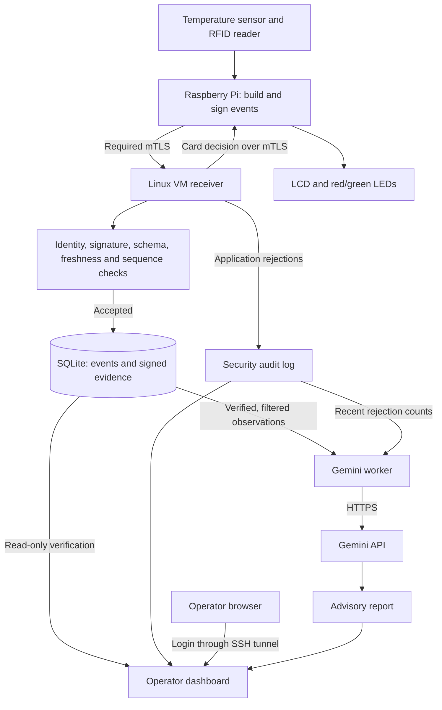

# RackGuard

### Verified IoT telemetry for data centre monitoring

**A reading is useful. Knowing why you can accept it is better.**

RackGuard is a security-focused IoT prototype that connects temperature and RFID monitoring with authenticated device communication, signed messages and visible security evidence. Built for **Track 3: Security & Resilience** at an IoT hackathon, it explores a practical question:

> How can an operator distinguish accepted telemetry from a message that has been altered, replayed or submitted without the right credentials?

Our four-person team brought together networking, computer science, AI and mechatronics to build the system from the physical sensors to the operator dashboard.

**Project status:** hackathon prototype · **Validation:** 44 automated tests passed locally on the consolidated v8 package · **AI role:** advisory only

## The problem

Monitoring systems depend on the data they receive. An altered temperature message, a reused event or an unauthorized submission can undermine the picture presented to an operator.

RackGuard checks the connection and the message before accepting telemetry. It then retains signed event evidence and makes application-level rejections visible through a dashboard. This helps operators investigate what happened without assuming every received reading is trustworthy.

The prototype is designed around a data-centre rack or restricted equipment room. It demonstrates security controls and their limits; it is not a production-certified access-control system.

## What we built

### Sensor monitoring and RFID feedback

A Raspberry Pi collects temperature readings and RFID scans. The RFID UID is converted locally into a keyed HMAC token, keeping the raw identifier out of the transmitted event.

The server checks card tokens against its allowlist. The Pi's LCD and LED integration displays the returned result:

- **ACCESS GRANTED:** the server approved the card token.
- **ACCESS DENIED:** the server did not authorize the card token.
- **NO DECISION:** a valid server decision was not received.

Accepting an RFID event and granting access are separate outcomes. The prototype provides access indicators; it does not implement a physical door lock.

### Verification before acceptance

RackGuard combines several independent controls:

- **Mutual TLS:** the Pi and receiver authenticate their connection using certificates.
- **Certificate-to-device binding:** the receiver checks that the presented certificate fingerprint matches the enrolled device identity.
- **Ed25519 signatures:** the Pi signs event bytes; the receiver detects changes made after signing.
- **Freshness checks:** timestamps must fall within the configured acceptance window.
- **Persistent sequence checks:** reused or lower sequence numbers are rejected using stored state.
- **Request restrictions:** payload validation, size limits and rate limits constrain submissions.

The basic sensors do not create the signatures. The Raspberry Pi reads them, constructs the event and signs it before transmission.

### Evidence that can be checked after storage

Accepted events are stored in SQLite alongside their original signed bytes and signatures. Supported stored telemetry fields can be checked against this evidence later.

The dashboard verifies its recent event window before displaying readings and withholds rows that fail verification. Records without signature evidence are identified separately.

### An operator dashboard

The Flask dashboard connects live monitoring, security evidence and advisory analysis in one operator interface. Explore the views below; each screenshot can be opened at full size.

Operator access is separate from device ingestion. In the prototype deployment, the dashboard requires an operator login and is accessed through an SSH tunnel to a loopback-only listener.

#### Live overview

Recent temperature readings and RFID activity give the operator a view of incoming telemetry.

<strong>View monitoring status and indicators</strong>

Freshness and simulation indicators help distinguish current observations from stale or simulated data.

<strong>View telemetry analytics</strong>

Charts present recent stored events that passed the dashboard's verification checks.

<strong>View security alerts</strong>

Rejection history and recent high-priority banners show when an application-level security check failed.

<strong>View Gemini advisory analysis</strong>

Gemini-generated reports explain filtered observations and suggest checks. Reports are advisory and do not control authorization.

### AI assistance without AI enforcement

Gemini summarizes filtered observations and suggests checks for the operator. Its input includes reduced sensor observations and recent rejection counts, excluding raw RFID identifiers, card tokens, device identifiers and private credentials.

The model cannot approve a card, change authorization rules or disable verification. If the API is unavailable, telemetry checks continue independently, and older reports are marked stale.

## How it fits together

This diagram describes the implemented prototype, rather than a proposed production deployment. It groups validation controls for readability; it does not specify every code branch's execution order.

## The security demonstration

Our central demonstration follows one continuous sequence:

1. **Observe accepted telemetry.** The Pi submits an event and the dashboard shows the reading.
2. **Change a signed message.** A test signs a simulated temperature event, then changes its value without creating a new signature.
3. **Observe the rejection.** The receiver returns `403 BAD_AUTHENTICATION` for the modified message.
4. **Inspect the alert.** The dashboard presents the rejection reason and time.
5. **Check subsequent telemetry.** Later valid readings establish whether normal monitoring continues.

The tampering test uses deliberately simulated data. It demonstrates message verification, not a physical temperature change. Physical sensor operation, simulation and automated tests should be distinguished when interpreting project evidence.

## Validation

The consolidated v8 package passed **44 automated tests locally**:

- **35 tests** covering the existing ingestion, mTLS, replay/state, database evidence, dashboard and alert behavior.
- **6 tests** covering Gemini input filtering, response/error handling and report compatibility using mocked API responses.
- **3 tests** covering server-controlled card decisions and access-display behavior.

During integration, the team also obtained successful Pi-to-VM submissions, a working operator dashboard and a successful live Gemini report generation.

Automated tests do not establish physical hardware correctness, production readiness or comprehensive resistance to attack. See [TEST_RESULTS.md](TEST_RESULTS.md) for the recorded test scope.

## Technology

- **Hardware:** Raspberry Pi, DHT22 temperature sensor, PN532 RFID reader, 16×2 I²C LCD and indicator LEDs.
- **Application:** Python, Flask and Requests.
- **Security:** mutual TLS, Ed25519, certificate fingerprint binding and keyed HMAC RFID tokens.
- **Persistence:** SQLite for event evidence and persistent state.
- **Interface:** HTML, CSS and JavaScript with local dashboard assets.
- **AI:** Gemini API, invoked by a separate VM-side worker.

Some internal paths and identifiers retain the earlier **ColdGuard** name to preserve compatibility with the project's original deployment. RackGuard is the final data-centre monitoring concept.

## What we learned

**An authenticated connection is only one part of trust.** A device can establish a valid connection while submitting a message that fails an independent check.

**Message integrity and availability are different problems.** Connection disruptions during mentor testing showed why operational recovery matters alongside cryptographic validation. The observed errors alone did not establish the exact attack technique.

**An explanation is not an authorization decision.** Keeping Gemini outside enforcement made its role easier to understand and limited the consequences of an unavailable or misleading report.

**Integration needs evidence.** Hardware, networking, application state and the interface each required their own checks. Passing a software test and observing the full physical workflow are different kinds of evidence.

## Boundaries of the prototype

We document these limits alongside the implemented controls:

- A valid signature does not guarantee sensor accuracy. A compromised Pi can sign false readings.
- RFID pseudonymization does not prevent card cloning or identify the person holding a card.
- Stored signatures do not prove database completeness or prevent deletion, rollback or full VM compromise.
- Server-generated metadata and audit records are not all covered by the Pi's signature.
- The dashboard verifies a bounded recent window, not the entire database on every refresh.
- TLS handshake failures occur before the application and are outside the dashboard's rejection feed.
- Application rate limiting is not complete denial-of-service protection.
- Service startup and recovery remain manual; durable offline delivery is not implemented.
- Certificate expiry exists, but automated renewal and a complete revocation service are future work.
- Private keys are stored in restricted files, not a hardware secure element.

## Where we would take it next

The first priority is dependable operation: managed service startup, recovery monitoring and controlled certificate renewal. Further work includes protected external audit storage, hardware-backed keys, validated site-specific sensor thresholds and broader fault/load testing.

Offline buffering would need to be designed alongside freshness and replay rules, rather than added as an unrestricted resend mechanism.

These are roadmap items, not claims about the current release.

## Team and acknowledgements

RackGuard was developed by a four-member team combining:

- **Networking (Sofea):** connectivity, VM deployment, integration troubleshooting and demonstration coordination.
- **Mechatronics (Kamal):** sensor wiring, hardware integration and physical validation.
- **Artificial intelligence (Nureen):** advisory analysis integration and interpretation of observations.
- **Computer science (Putri):** application integration, security controls, persistence and testing.

Thank you to the Track 3 mentors and organizers for their guidance, practical challenges and feedback throughout the event.

AI-assisted development tools supported parts of implementation and documentation. The repository's test evidence and stated limitations describe what was checked; generated code alone is not evidence of correctness.

## Explore the project

- [Source repository](https://github.com/d1msums/rackguard)
- [Deployment notes](START_HERE.md)
- [Recorded test results](TEST_RESULTS.md)

The source release uses configuration templates. Live API keys, passwords, private certificates/keys and operational databases do not belong in the public repository.

---

**RackGuard — confidence in the message, clarity for the operator.**
